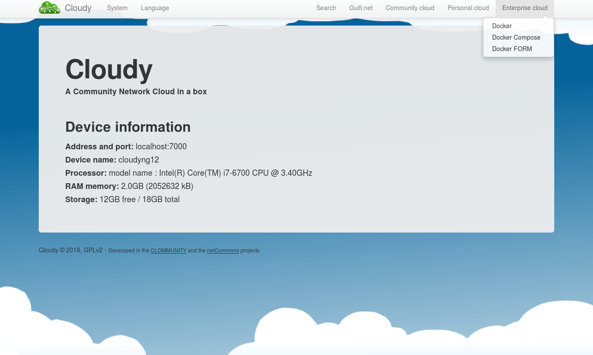
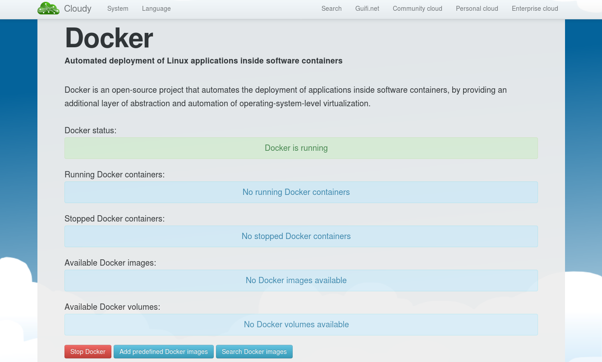
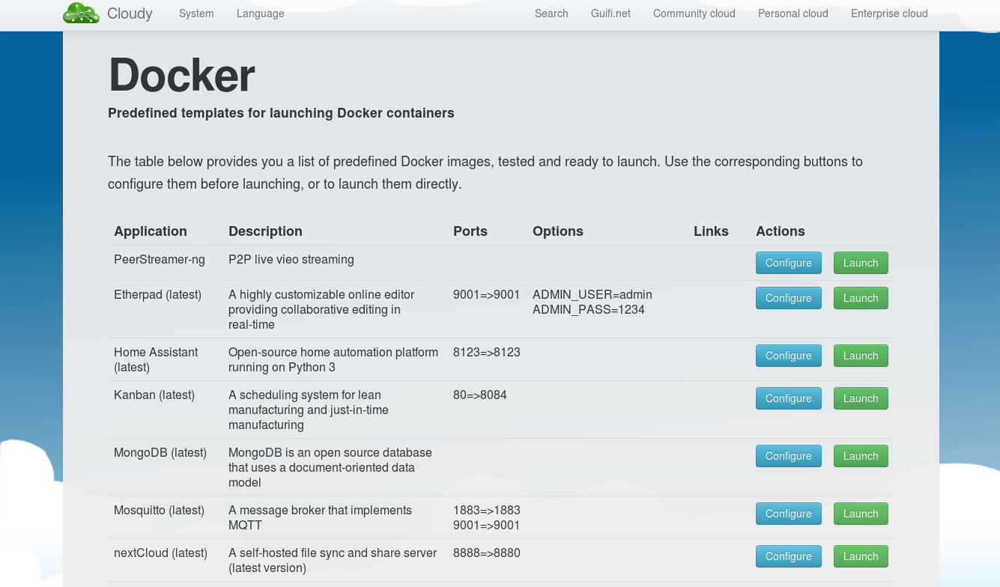
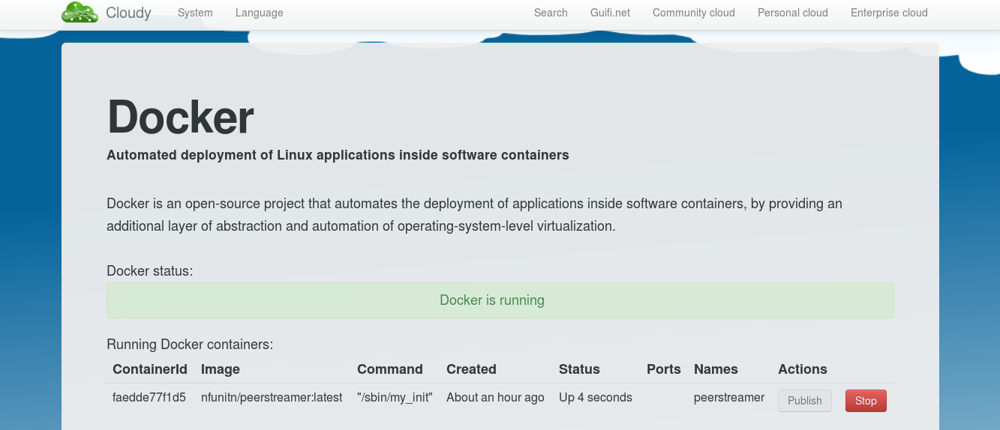
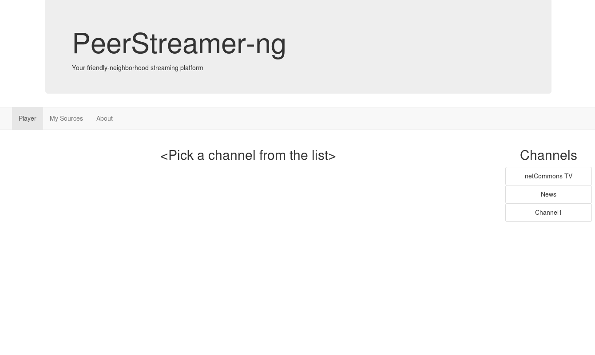

# PeerStreamer-NG docker imange

For generating the peerstreamer docker image run the following command:

```
docker build -t peerstreamer .
```

If you intend to push the image on docker hub it is better to use directly the
tag that includes your user name. Supposing the username is xxx and the
repository is called peerstreamer:

```
docker build -t xxx/peerstreamer .
```

In order to push the new image the following command are required (and an
account on [hub.dovker](https://hub.docker.com)):

```bash
docker login (this requires username and password)
docker push xxx/peerstreamer (this implies latest as tag, use
peerstreamer:<tag> to change the version)
```

Run the container with the following command:

```
docker run -d peerstreamer
```

# Base image

Currently the peerstreamer docker image is based on baseimage-docker that, among
other things, provides mechanisms for easily running multiple processes (for
more information look at [here](https://github.com/phusion/baseimage-docker)).

Basic documentation for adding additional services is provided [here](https://github.com/phusion/baseimage-docker#adding-additional-daemons)

baseimage-docker provides an easy way for setting up an ssh server for logging
into the container as described [here](https://github.com/phusion/baseimage-docker#login-to-the-container-or-running-a-command-inside-it-via-ssh)


# Inspecting peerstreamer image

For debugging reasons it can be useful to have the ability to look around in the
peerstreamer image. This can be achieved with the following command:

```
docker run --rm -t -i peerstreamer /sbin/my\_init -- bash -l
```

# Cloudy

This section contains a short tutorial that explains how to install the
PeerStreamer-ng Docker image into
[Cloudy](https://github.com/netCommonsEU/cDistro). This guide does not
describe how to install Cloudy, we assume that a node with Cloudy correctly
installed and configured is already available. If Cloudy is available you
should be able to connect to the Cloudy node by pointing you browser to
http://<cloudy_node_ip>:7000.

> WARNING: the latest tested version of Cloudy (commit 8ffd754) contains a
few bugs that make it impossible to install the PeerStreamer-ng Docker image
using only the web interface provided by Cloudy. The bugs can be bypassed by
manually writing one of the required configuration files and in order to do
this you need local access with root permissions to the cloudy node.

The first step for installing the PeerStreamer-ng Docker image requires to
create a configuration file that describes the PeerStreamer-ng Docker image
in a format recognized by Cloudy. In order to complete this step you need
local access to the Cloudy node with root permissions.

In `/var/local/cDistro/plug/resources/docker/containers/` create a new file
called `PeerStreamer-ng_latest.json` with the following content:

```code
{
 "appname": "PeerStreamer-ng",
 "description": "P2P live video streaming",
 "image": "--net host nfunitn/peerstreamer:latest",
 "name": "peerstreamer"
}
```

Now point your browser to http://<cloudy_node_ip>:7000 and enter the login
credentials. From the Cloudy start page click on "Enterprise cloud" ->
"Docker" as shown in the screenshot reported below:



Now you are on the "Docker" page that should appear similar to the screenshot
reported below:



Now open the list of available Docker images by clicking on "Add predefined
Docker images". This should open the page containing the list of Docker
images ready to be launched and PeerStreamer-ng shoud appear among them.
In the example reported below PeerStreamer-ng is the first entry:



Now you can finally launch PeerStreamer-ng by clicking on "Launch". This will
start the PeerStreamer-ng container in background.

> NOTE: if this is the first time you perform this operation, Cloudy will
take care of downloading the peerstreamer image from [Docker
Hub](https://hub.docker.com/r/nfunitn/peerstreamer/). The time required for
this operation depends on the download speed of your connection. Once the
image has been downloaded, the next time you launch the container the startup
time should be negligible.

Now, if you go back to "Enterprise cloud" -> "Docker", you should see the
peerstreamer container listed under "Running Docker containers" as shown in
the example reported below:



Now you can connect to PeerStreamer-ng web page by pointing your browser to
http://<cloudy_node_ip>:3000 and something similar to the example reported
below should appear:



as you can see the available channels are listed on the right side of the page.

>NOTE: for adding and deleting channels from the Serf cluster see the
[`psng-pyserf` tool
documentation](https://github.com/netCommonsEU/psng-pyserf/blob/master/README.md)

>NOTE: for information about how to stream a video content take a look at the
script provided
[here](https://github.com/netCommonsEU/PeerStreamer-ng/tree/webrtp#the-source)
